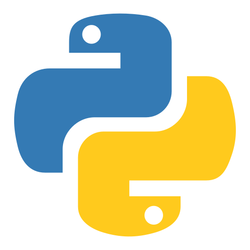
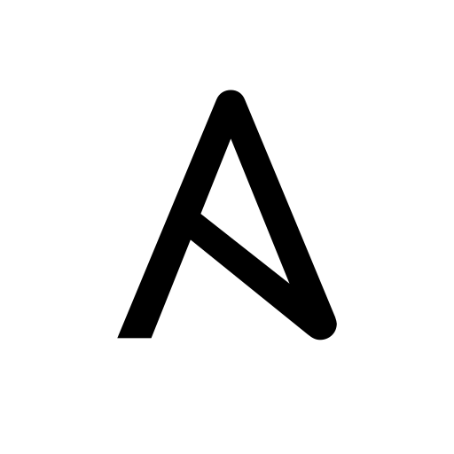
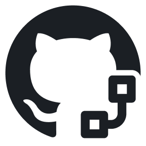
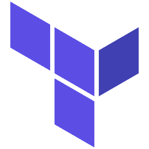
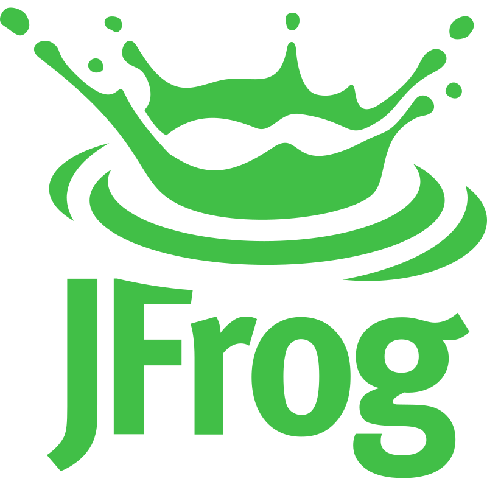
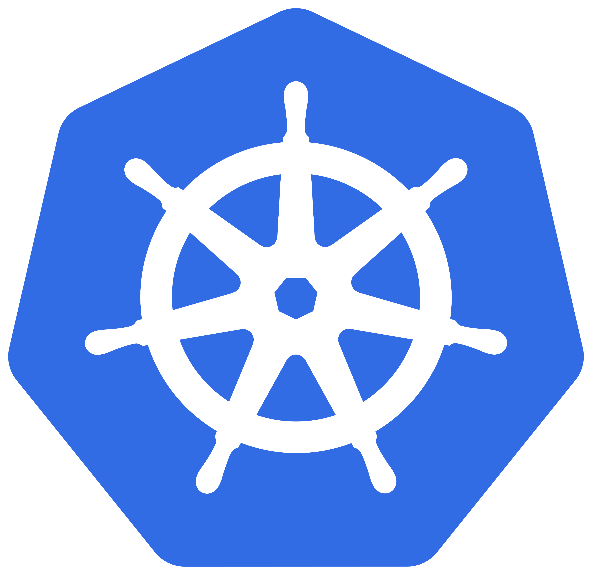

## Hola soy Juan Daniel Cavero Tovar

Mi usuario es @danielex1999

:books: **Actualmente estoy aprendiendo:**

| Por aprender      | En progreso |
| :----: | :----: |
|<code></code> <code></code> <code></code> <code></code> <code></code> <code></code> <code></code> <code></code> <code></code> <code></code>| <code></code> <code></code>|

🏅 **Badges:**

## Sobre mí

:file_folder: **Tecnologías Aprendidas**

|CI/CD| DevOps| Versionamiento| Lenguajes| Testing/API| Database| Web/Framework| IDE's|
| :---: | :---: | :---: | :---: | :---: | :---: | :---: | :---: |
|<code></code> |<code></code> <code></code>|<code></code>  <code></code>  <code></code> |<code></code> <code></code>  <code></code>  |<code></code> <code></code> <code></code> |<code></code> |<code></code> <code></code> <code></code> |<code></code> <code></code>|

## Certificaciones

Actualmente estoy aprendiendo y preparándome para obtener las siguientes certificaciones:

| Por hacer      | En progreso |
| :----: | :----: |
|<code></code> <code></code>   <code></code> <code></code>  <code></code> |<code></code> <code></code> | 

